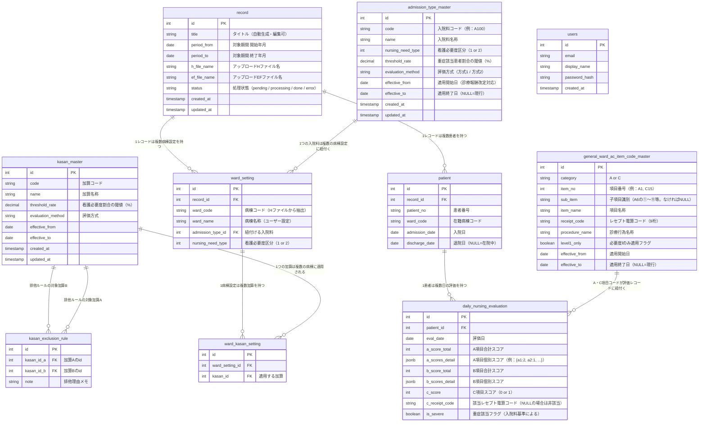

# 看護必要度管理システム ER図

**Version:** 0.3  
**作成日:** 2026年2月  
**ステータス:** ドラフト（開発着手前）

---

## 更新履歴

| バージョン | 更新日 | 内容 |
|-----------|--------|------|
| 0.1 | 2026年2月 | 初版作成 |
| 0.2 | 2026年2月 | `c_item_code_master` を `ac_item_code_master` にリネーム。カラム構成をA・C項目コードマスタTSVの構成に合わせて更新 |
| 0.3 | 2026年2月 | `ac_item_code_master` を `general_ward_ac_item_code_master` にリネーム（一般病棟用マスタであることを明示） |

---

## ER図

---

## テーブル定義補足

### マスタ系

| テーブル名 | 用途 | 備考 |
|-----------|------|------|
| admission_type_master | 入院基本料の種別・閾値管理 | 診療報酬改定に対応するため `effective_from` / `effective_to` で期間管理 |
| kasan_master | 加算の種別・閾値管理 | 同上 |
| kasan_exclusion_rule | 加算の排他ルール管理 | A↔Bの組み合わせで双方向に定義（順序不問） |
| general_ward_ac_item_code_master | レセプト電算コード↔A・C項目分類の対応 | A項目・C項目の自動判定に使用。level1_onlyフラグで必要度Ⅰのみ適用コードを管理 |

### レコード系

| テーブル名 | 用途 | 備考 |
|-----------|------|------|
| record | HF・EFファイル1セット＋設定のまとまり | ホーム画面の1行に対応 |
| ward_setting | レコードごとの病棟コード↔入院料の紐付け | 前回レコードの設定を引き継いでデフォルト提案する元データ |
| ward_kasan_setting | 病棟設定と加算の中間テーブル | 1病棟に複数加算が適用される一対多を解消 |

### データ系

| テーブル名 | 用途 | 備考 |
|-----------|------|------|
| patient | Hファイルから取り込んだ患者基本情報 | recordに紐付く |
| daily_nursing_evaluation | EFファイルから取り込んだ日次評価データ | A・B項目は合計スコアと個別スコア（JSONB）を両方保持。C項目は判定結果（0 or 1）のみ保存 |

### ユーザー系

| テーブル名 | 用途 | 備考 |
|-----------|------|------|
| users | ログインアカウント管理 | **初版スコープ外**。将来のサービス化時に有効化 |

---

## 設計上の重要な考慮点

**A・B項目スコアの保存方針**として、合計スコア（`a_score_total`）と個別スコア（`a_scores_detail` JSONB）の両方を保持する。合計は集計クエリの高速化のため、個別は Tab 3（看護必要度詳細）やTab 4（分析）での項目別ドリルダウンのために必要。

**C項目の保存方針**として、判定結果（0 or 1）のみ `daily_nursing_evaluation` に保存する。判定の根拠となるレセプト電算コードは `c_receipt_code` として合わせて保存し、`general_ward_ac_item_code_master` との照合で分類を確認できる。

**診療報酬改定への対応**として、`admission_type_master` と `kasan_master` には `effective_from` / `effective_to` を設けており、改定前後のデータが混在する期間も正しく閾値を参照できる。

**病棟設定の引き継ぎ**は `ward_setting` テーブルをレコード間で参照することで実現する。新規レコード作成時に直前レコードの `ward_setting` を読み取り、デフォルト値として画面に表示する。

---

## 未決事項

| # | 事項 | ステータス |
|---|------|-----------|
| 1 | A・B項目の個別スコアフィールド名（EFファイルのフィールド仕様確認後に確定） | 要確認 |
| 2 | `daily_nursing_evaluation` の `is_severe` フラグの判定基準（入院料ごとに異なる可能性） | 要設計 |
| 3 | PGliteにおけるJSONB型の取り扱い確認 | 要検証 |

---

*以上*
