# 看護必要度管理システム ER図

**Version:** 0.4  
**作成日:** 2026年2月  
**ステータス:** ドラフト（開発中）

---

## 更新履歴

| バージョン | 更新日 | 内容 |
|-----------|--------|------|
| 0.1 | 2026年2月 | 初版作成 |
| 0.2 | 2026年2月 | `c_item_code_master` を `ac_item_code_master` にリネーム。カラム構成をA・C項目コードマスタTSVの構成に合わせて更新 |
| 0.3 | 2026年2月 | `ac_item_code_master` を `general_ward_ac_item_code_master` にリネーム（一般病棟用マスタであることを明示） |
| 0.4 | 2026年2月 | 入院料マスタを3テーブル構成に再設計（`judgment_pattern_master` + `admission_type_master` + `admission_type_criteria`）。`record` に `evaluation_method` を追加。`ward_setting` から `nursing_need_type` を削除 |

---

## ER図

```mermaid
erDiagram

    %% ==================
    %% マスタ系
    %% ==================

    judgment_pattern_master {
        int id PK
        string code "判定パターンコード（P1〜P7）"
        string label "画面表示用の条件説明（例：A>=3 or C>=1）"
        timestamp created_at
        timestamp updated_at
    }

    admission_type_master {
        int id PK
        string name "入院料名称（例：急性期一般入院料1）"
        string category "区分（general / icu / hcu / rehabilitation）"
        timestamp created_at
        timestamp updated_at
    }

    admission_type_criteria {
        int id PK
        int admission_type_id FK "入院料マスタへの参照"
        int judgment_pattern_id FK "判定パターンマスタへの参照"
        string criteria_no "基準番号（例：基準①、基準②）"
        decimal threshold_rate "重症該当患者割合の閾値（%）NULLable"
    }

    kasan_master {
        int id PK
        string code "加算コード"
        string name "加算名称"
        int judgment_pattern_id FK "判定パターンマスタへの参照"
        decimal threshold_rate "看護必要度割合の閾値（%）"
        date effective_from
        date effective_to
        timestamp created_at
        timestamp updated_at
    }

    kasan_exclusion_rule {
        int id PK
        int kasan_id_a FK "加算Aのid"
        int kasan_id_b FK "加算Bのid"
        string note "排他理由メモ"
    }

    general_ward_ac_item_code_master {
        int id PK
        string category "A or C"
        int item_no "項目番号（例：A1, C15）"
        string sub_item "子項目識別（A6の①〜⑪等。なければNULL）"
        string item_name "項目名称"
        string receipt_code "レセプト電算コード（9桁）"
        string procedure_name "診療行為名称"
        boolean level1_only "必要度Ⅰのみ適用フラグ"
        date effective_from "適用開始日"
        date effective_to "適用終了日（NULL=現行）"
    }

    %% ==================
    %% レコード系
    %% ==================

    record {
        int id PK
        string title "タイトル（自動生成・編集可）"
        date period_from "対象期間 開始年月"
        date period_to "対象期間 終了年月"
        string evaluation_method "評価方式（necessity_1 / necessity_2）"
        string h_file_name "アップロードHファイル名"
        string ef_file_name "アップロードEFファイル名"
        string status "処理状態（pending / processing / done / error）"
        timestamp created_at
        timestamp updated_at
    }

    ward_setting {
        int id PK
        int record_id FK
        string ward_code "病棟コード（H/EFファイルから自動抽出）"
        string ward_name "病棟名称（任意・ユーザー入力）"
        int admission_type_id FK "紐付ける入院料（NULLable）"
    }

    ward_kasan_setting {
        int id PK
        int ward_setting_id FK
        int kasan_id FK "適用する加算"
    }

    %% ==================
    %% データ系（HF・EFから取り込み）
    %% ==================

    patient {
        int id PK
        int record_id FK
        string patient_no "患者番号"
        string ward_code "在籍病棟コード"
        date admission_date "入院日"
        date discharge_date "退院日（NULL=在院中）"
    }

    daily_nursing_evaluation {
        int id PK
        int patient_id FK
        date eval_date "評価日"
        int a_score_total "A項目合計スコア"
        jsonb a_scores_detail "A項目個別スコア（例：{a1:2, a2:1, ...}）"
        int b_score_total "B項目合計スコア"
        jsonb b_scores_detail "B項目個別スコア"
        int c_score "C項目スコア（0 or 1）"
        string c_receipt_code "該当レセプト電算コード（NULLの場合は非該当）"
        boolean is_severe "重症該当フラグ（入院料基準による）"
    }

    %% ==================
    %% ユーザー系（将来用・初版スコープ外）
    %% ==================

    users {
        int id PK
        string email
        string display_name
        string password_hash
        timestamp created_at
    }

    %% ==================
    %% リレーション
    %% ==================

    judgment_pattern_master ||--o{ admission_type_criteria : "1パターンは複数の入院料基準に使われる"
    admission_type_master ||--o{ admission_type_criteria : "1入院料は複数の判定基準を持つ"
    admission_type_master ||--o{ ward_setting : "1つの入院料は複数の病棟設定に紐付く"
    judgment_pattern_master ||--o{ kasan_master : "1パターンは複数の加算に使われる"
    kasan_master ||--o{ ward_kasan_setting : "1つの加算は複数の病棟に適用される"
    kasan_master ||--o{ kasan_exclusion_rule : "排他ルールの対象加算A"
    kasan_master ||--o{ kasan_exclusion_rule : "排他ルールの対象加算B"
    general_ward_ac_item_code_master ||--o{ daily_nursing_evaluation : "A・C項目コードが評価レコードに紐付く"

    record ||--o{ ward_setting : "1レコードは複数病棟設定を持つ"
    record ||--o{ patient : "1レコードは複数患者を持つ"
    ward_setting ||--o{ ward_kasan_setting : "1病棟設定は複数加算を持つ"

    patient ||--o{ daily_nursing_evaluation : "1患者は複数日の評価を持つ"
```

---

## テーブル定義補足

### マスタ系

| テーブル名 | 用途 | 備考 |
|-----------|------|------|
| judgment_pattern_master | 重症該当患者の判定ロジックパターン（P1〜P7）を管理 | `code` で計算エンジンが参照、`label` で画面表示 |
| admission_type_master | 入院基本料の種別管理 | `category` で一般/ICU/HCU等を区別 |
| admission_type_criteria | 入院料と判定パターンの中間テーブル | 1つの入院料に複数基準（例：急性期一般1はP1+P2）が紐付く |
| kasan_master | 加算の種別・閾値管理 | 判定パターンを直接参照。`effective_from`/`effective_to` で期間管理 |
| kasan_exclusion_rule | 加算の排他ルール管理 | A↔Bの組み合わせで双方向に定義（順序不問） |
| general_ward_ac_item_code_master | レセプト電算コード↔A・C項目分類の対応 | A項目・C項目の自動判定に使用 |

### レコード系

| テーブル名 | 用途 | 備考 |
|-----------|------|------|
| record | HF・EFファイル1セット＋設定のまとまり | `evaluation_method` でレコード全体の看護必要度区分（Ⅰ/Ⅱ）を管理 |
| ward_setting | レコードごとの病棟コード↔入院料の紐付け | 病棟コードはファイルから自動抽出。名称は任意入力 |
| ward_kasan_setting | 病棟設定と加算の中間テーブル | 1病棟に複数加算が適用される一対多を解消 |

### データ系

| テーブル名 | 用途 | 備考 |
|-----------|------|------|
| patient | Hファイルから取り込んだ患者基本情報 | recordに紐付く |
| daily_nursing_evaluation | EFファイルから取り込んだ日次評価データ | A・B項目は合計スコアと個別スコア（JSONB）を両方保持。C項目は判定結果（0 or 1）のみ保存 |

### ユーザー系

| テーブル名 | 用途 | 備考 |
|-----------|------|------|
| users | ログインアカウント管理 | **初版スコープ外**。将来のサービス化時に有効化 |

---

## 設計上の重要な考慮点

**看護必要度区分（Ⅰ/Ⅱ）の配置:** `evaluation_method` は `record` テーブルに配置する。看護必要度区分はレコード作成時に1回選択するものであり、病棟ごとに変わるものではない。

**入院料マスタの判定パターン:** `admission_type_criteria` を中間テーブルとして、1つの入院料に複数の判定基準を紐付けられる。例えば急性期一般入院料1は P1（基準①）と P2（基準②）の両方を満たす必要がある。

**A・B項目スコアの保存方針:** 合計スコア（`a_score_total`）と個別スコア（`a_scores_detail` JSONB）の両方を保持する。合計は集計クエリの高速化のため、個別は項目別ドリルダウンのために必要。

**C項目の保存方針:** 判定結果（0 or 1）のみ保存。判定根拠のレセプト電算コードは `c_receipt_code` として合わせて保存する。

**診療報酬改定への対応:** `kasan_master` には `effective_from` / `effective_to` を設けており、改定前後のデータが混在する期間も正しく閾値を参照できる。

**病棟設定の引き継ぎ:** `ward_setting` テーブルをレコード間で参照し、新規レコード作成時に直前レコードの設定をデフォルト提案する。

---

## 未決事項

| # | 事項 | ステータス |
|---|------|-----------|
| 1 | A・B項目の個別スコアフィールド名（EFファイルのフィールド仕様確認後に確定） | 要確認 |
| 2 | `daily_nursing_evaluation` の `is_severe` フラグの判定基準（入院料ごとに異なる可能性） | 要設計 |
| 3 | PGliteにおけるJSONB型の取り扱い確認 | 要検証 |
| 4 | 判定パターン P1〜P7 の条件式を構造化データとして保持するか（将来の自動判定エンジン用） | 要設計 |

---

*以上*
