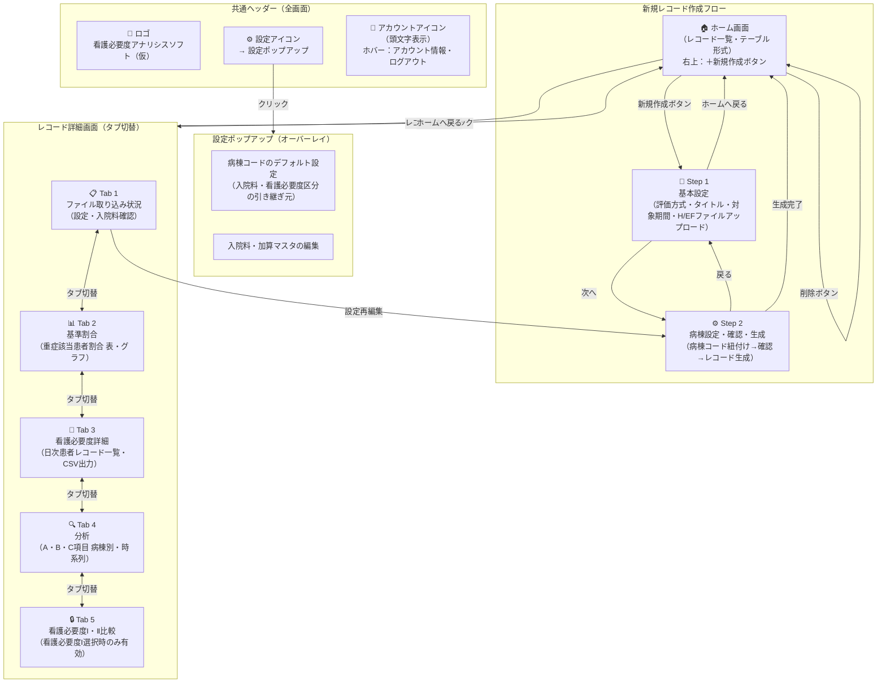

# 看護必要度管理システム 画面遷移図

**Version:** 0.4  
**作成日:** 2026年2月  
**ステータス:** ドラフト

---

## 更新履歴

| バージョン | 更新日 | 内容 |
|-----------|--------|------|
| 0.1 | 2026年2月 | 初版作成 |
| 0.2 | 2026年2月 | ヘッダー構成・設定ポップアップ・ホーム画面レイアウトを追記 |
| 0.3 | 2026年2月 | ホーム画面からカード切替・並び替え・タブフィルターを削除。シンプルなテーブル形式に確定 |
| 0.4 | 2026年2月 | 新規レコード作成フローを3ステップから2ステップに変更。ホームへ戻るボタン追加 |

---

## 画面遷移図

---

## 補足説明

### 共通ヘッダー

全画面に共通して表示されるヘッダーの構成は以下の通り。

| 配置 | 要素 | 挙動 |
|------|------|------|
| 左端 | ロゴ | 「看護必要度アナリシスソフト（仮）」。クリックでホーム画面へ |
| 右側 | 歯車アイコン | クリックで設定ポップアップをオーバーレイ表示 |
| 右端 | アカウントアイコン | ログイン中アカウントの頭文字を表示。ホバーでアカウント情報・ログアウトボタンを表示 |

### 設定ポップアップ

ヘッダーの歯車アイコンから呼び出すオーバーレイ形式のポップアップ。含む設定項目は以下の通り。

| 設定項目 | 内容 |
|---------|------|
| 病棟コードのデフォルト設定 | 新規レコード作成時に引き継ぐ入院料・看護必要度区分のデフォルト値を管理 |
| 入院料・加算マスタの編集 | 対象入院料・加算の名称・閾値・排他ルール等を編集 |

### ホーム画面レイアウト

NotebookLMライクなシンプルなテーブル形式を採用。

| 項目 | 仕様 |
|------|------|
| 表示形式 | テーブル形式のみ（カード切替・並び替え・タブフィルターなし） |
| 列構成 | タイトル / 対象期間 / 病棟数 / 作成日 / 充足状況 |
| タイトル | 対象期間から自動生成（例：「2025年10月分」）をデフォルトとし、ユーザーが編集可能 |
| 新規作成 | 右上の「＋ 新規作成」ボタンから作成フローに進む |
| レコード操作 | 行クリックで詳細画面へ遷移、削除ボタンで一覧から除外（復元不可） |

### 新規レコード作成フロー

| ステップ | 画面名 | 主な操作 |
|---------|--------|---------|
| Step 1 | 基本設定・ファイルアップロード | 評価方式（Ⅰ/Ⅱ）選択・タイトル入力・対象期間指定・HファイルとEFファイルをアップロード |
| Step 2 | 病棟設定・確認・生成 | Step 1サマリー確認・病棟コード紐付け・生成ボタンで処理実行・完了後ホーム画面へ |

### レコード詳細画面（タブ）

| タブ | 画面名 | 閲覧条件 | 状態 |
|-----|--------|---------|------|
| Tab 1 | ファイル取り込み状況 | 常時 | 実装予定 |
| Tab 2 | 基準割合 | 常時 | 実装予定 |
| Tab 3 | 看護必要度詳細 | 常時 | 実装予定 |
| Tab 4 | 分析 | 常時 | 実装予定 |
| Tab 5 | 看護必要度Ⅰ・Ⅱ比較 | 看護必要度Ⅰ選択時のみ | 将来実装（Ⅱ選択時はグレーアウト＋ホバーでツールチップ表示） |

### 特記事項

- **設定再編集:** Tab 1（ファイル取り込み状況）から Step 2（初期設定）に戻って設定を変更できる。変更後はデータを再処理する
- **レコード削除:** ホーム画面から実行。削除後は一覧から除外され復元不可
- **Tab 5 グレーアウト仕様:** 看護必要度Ⅱが選択されたレコードでは Tab 5 は常に表示されるが操作不可。マウスホバー時に「この画面は看護必要度Ⅰが選択されている場合のみ閲覧できます」のツールチップを表示する

---

*以上*
